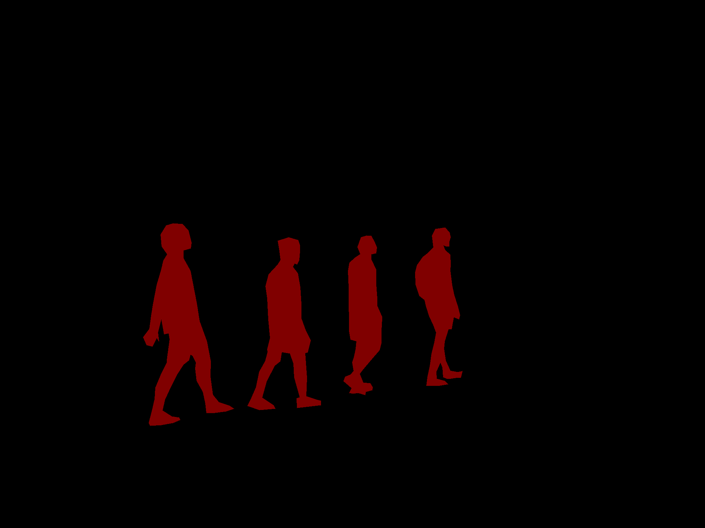

# evolv-image-ml
A collection of programs to create and run an image segmentation model using open source code. Developed for Evlov AI.

## Requirements
- [segmentation_models](https://github.com/qubvel/segmentation_models) by [qubvel](https://github.com/qubvel)  
- [tensorflow](https://www.tensorflow.org/install)  
- [OpenCV](https://opencv.org/releases/)  
- [Albumentations](https://albumentations.ai/docs/getting_started/installation/)  
- Numpy:
```zsh
pip install numpy
```
- Matplotlib
```zsh
pip install matplotlib
```

## Usage
Training, testing, and validation data must be provided in a data directory with the following files and directories:

data
- test
- testannot
- train
- trainannot
- val 
- valannot

These directories should contain png files of an image and a corresponding annotated mask.
For example, in train we might have


and in trainannot, we would have



The index of each image in a directory must coorespond with that of its mask.

Next, the user must open preprocess.py and edit the 'classes' dictionary in line 7 so that each bin of the dictionary is a segmentation class, and each bin contains the pixel value of the class within the mask.

For example:

```python
classes = {'human':[1,1,1], 'car':[2,2,2], 'tree':[3,3,3]}
```

Additionally, the user must set 'DATA_DIR' in line 6 of preprocess.py to the path of the data directory.

For example:

```python
DATA_DIR = 'data'
```

Once the 'data' directory exists, run the following command to preprocess the images:
```zsh
python3 ./preprocess.py
```

To train a model, enter:
```zsh 
python3 ./unet_training.py
```
This will output the file best_model.h5, which is the file for the model.

Finally, to run this model to segment a new image, enter:
```zsh
python3 ./run.py best_model.h5 *imagename*
```
where imagename is the name of the image that is to be segmented.

This will output a mask of the image.